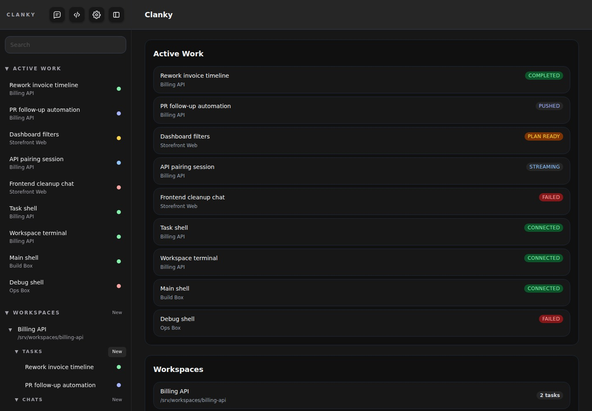
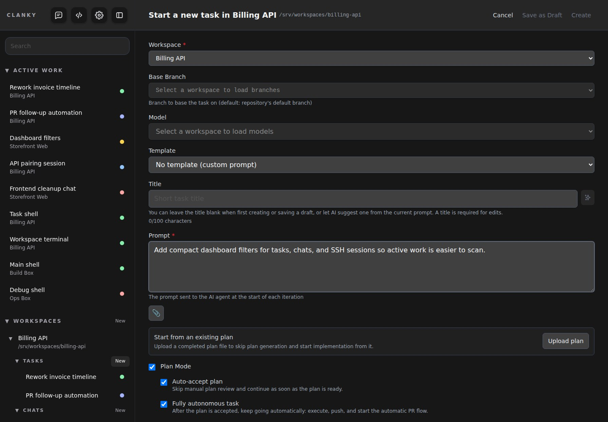
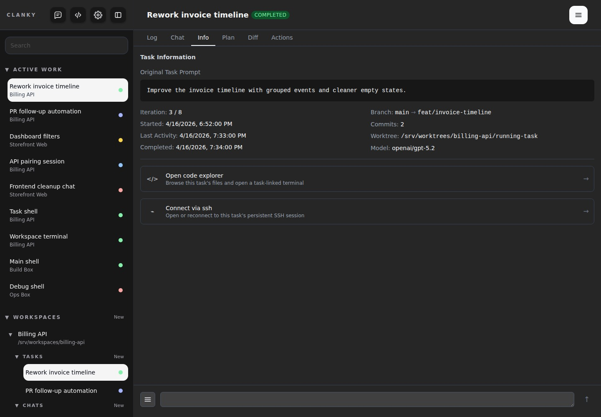
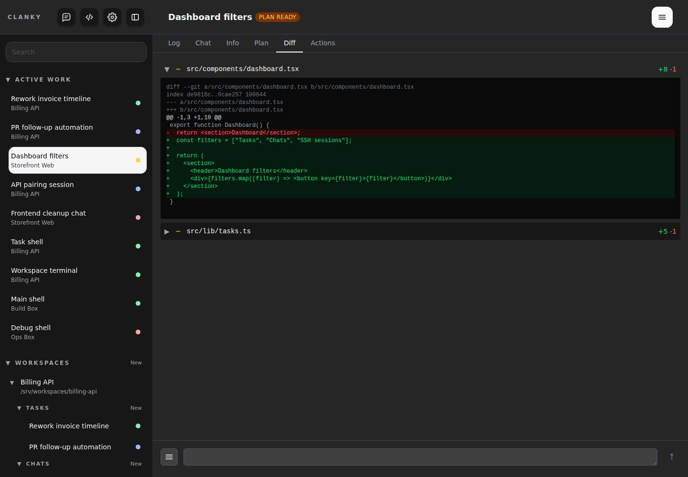
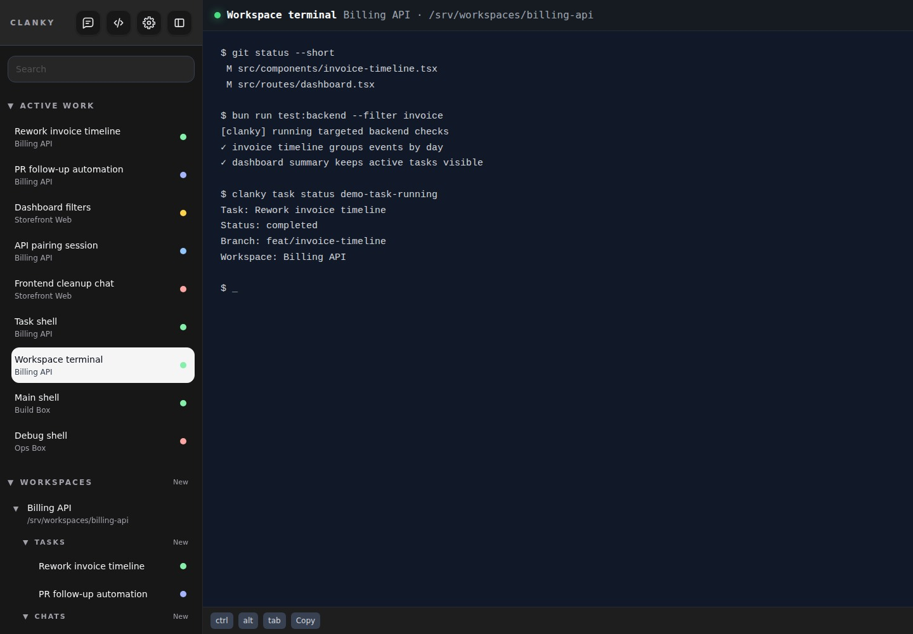

# Clanky

[](https://github.com/pablozaiden/clanky/releases/latest)
[](https://github.com/pablozaiden/clanky/actions/workflows/docker-main.yml)
[](LICENSE)
[](https://bun.sh)

Clanky is a coding agent manager for running, reviewing, and iterating on tasks with ACP-compatible agents such as Codex, Copilot, and OpenCode.

The repository is organized as a workspace-style monorepo:

- `apps/server` - web and API server.
- `apps/web` - browser bundle workspace for the shared web app assets
- `apps/cli` - standalone API client CLI
- `apps/tui` and `apps/electron` - reserved stubs for future client surfaces
- `packages/shared`, `packages/contracts`, `packages/client-sdk` - shared runtime-neutral types/helpers, API contracts, and client transport/auth utilities

## Best way to use Clanky

While Clanky can be used locally, accessing code repositories and running agents on the same machine, it really shines when it is used with SSH-backed workspaces. This allows you to keep your local machine free of agent processes and dependencies while still managing everything through the Clanky dashboard.

The recommended workflow is to treat Clanky as a controller for SSH-backed development environments, even when that SSH host is just your own machine.

1. Register an `ssh` server in Clanky. Using `localhost` is a great default if you want the SSH workflow without needing a separate remote machine.
2. Create an automatic workspace for each project you want to work on, and let that workspace use your `@pablozaiden/devbox`-managed environment so tools and dependencies are ready inside the project context. Automatic workspaces are docker containers created with [`@pablozaiden/devbox`](https://github.com/pablozaiden/devbox) and automatically exposed over SSH.
3. Once the workspace is ready, either open chats to work interactively with the coding agent in that workspace or create a new task, write the task prompt, and let the agent work autonomously.

**[Download the latest release](https://github.com/pablozaiden/clanky/releases/latest)**



*Dashboard overview with active tasks, workspaces, and quick actions.*

## Why Clanky

- **Safer automation.** Each task works in its own branch/worktree, commits iteration-by-iteration, and can be merged or discarded deliberately.
- **Operational visibility.** The dashboard gives you logs, diffs, plan review, task controls, and follow-up flows in one place.
- **Local or remote execution.** Workspaces can use local `stdio` transport or remote `ssh` transports.

<details>
<summary><strong>More screenshots</strong></summary>



*Create a task with prompt, model, and execution settings.*



*Track iteration status and task progress in real time.*



*Review the accumulated changes before accepting or pushing them.*



*Open persistent SSH sessions alongside task execution.*
</details>

## Installation

Install the latest Linux or macOS binary releases:

```bash
curl -fsSL https://raw.githubusercontent.com/pablozaiden/installer/main/install.sh | sh -s -- pablozaiden/clanky
```

The shared installer downloads the latest release assets for Linux or macOS (`x64` or `arm64`) and installs both `clanky` and `clanky-cli` in `$HOME/.local/bin`. If that directory is not on your `PATH`, the installer prints the shell profile line to add.

You can also download binaries directly from the [Releases page](https://github.com/pablozaiden/clanky/releases/latest).

Once installed from a release binary, you can update the installed release binaries in place:

```bash
clanky-cli update --check
clanky-cli update
clanky-cli update --version v0.8.1
```

## Quick start

### Requirements

- Git
- An ACP-capable CLI in your `PATH` (`codex`, `copilot`, and/or `opencode`)
- Optional SSH access to remote workspace hosts if you plan to use `ssh` transport
- [Bun](https://bun.sh) only if you want to run Clanky from source

### Run Clanky

```bash
# Installed server binary (embedded API + web, same-origin)
clanky

# Source development (combined API + web, same-origin)
bun dev

# Server process only
bun run dev:server
```

The UI is available at `http://localhost:3000` by default. Use `CLANKY_PORT` to change the port and `CLANKY_HOST` to change the bind address.

### CLI client commands

The separately installed `clanky-cli` binary exposes the terminal client surface:

```bash
# Check which version is installed
clanky-cli version

# Check whether a newer published binary is available
clanky-cli update --check

# Update the installed release binaries in place
clanky-cli update

# Install a specific published release
clanky-cli update --version v0.8.1

# Start device authorization against a specific Clanky server
clanky-cli auth http://localhost:3000

# Check whether stored CLI credentials are still valid
clanky-cli status

# List the discoverable REST endpoints
clanky-cli api

# Invoke an authenticated API request (prints one JSON object)
clanky-cli api tasks/my-task --method GET

# Inspect the expected schema for an endpoint
clanky-cli schema auth/device

# Stream authenticated websocket events over stdio
clanky-cli ws --task-id my-task
```

## Key features

- **Dashboard + API:** manage tasks from the browser or automate them through the REST API.
- **Plan mode:** review and refine a generated plan before code changes begin.
- **Review cycles:** continue from completed, pushed, or merged work with follow-up prompts and review comments.
- **Live observability:** stream logs, inspect diffs, and track task state.
- **Workspace flexibility:** configure provider and transport per workspace, including remote SSH-backed execution.

## Configuration and deployment

### Common environment variables

| Variable | Description | Default |
| --- | --- | --- |
| `CLANKY_HOST` | Host/interface passed to `Bun.serve` | `127.0.0.1` |
| `CLANKY_PORT` | HTTP port | `3000` |
| `CLANKY_DATA_DIR` | Data directory for SQLite persistence | `./data` |
| `CLANKY_REMOTE_ONLY` | Disables local `stdio` transport | unset |
| `CLANKY_MOCK_ACP` | Uses the built-in fake ACP runtime for local testing | unset |
| `CLANKY_DISABLE_PASSKEY` | Bypasses passkey enforcement when set to `true`, `1`, or `yes` | unset |
| `CLANKY_DISABLE_SAME_ORIGIN_CHECK` | Disables `Origin`/`Referer` validation for state-changing requests and WebSocket upgrades | unset |
| `CLANKY_LOG_LEVEL` | Server log level override | `info` |

### Auth notes

- Passkey authentication protects the browser session and device-approval flow.
- Bearer tokens are issued through the device authorization flow and work as an alternative to the browser passkey session for APIs, WebSocket upgrades, and forwarded-port proxy access.
- `clanky-cli auth` stores bearer credentials in per-user CLI state under the home directory, `clanky-cli status` validates them through `GET /api/auth/status`, `clanky-cli api` sends authenticated REST calls with the stored tokens, `clanky-cli ws` uses those same credentials for authenticated websocket upgrades to `/api/ws`, and `clanky-cli schema` exposes endpoint discoverability data from the built-in API catalog.
- Clanky exposes `/.well-known/openid-configuration` and `/.well-known/jwks.json` so external clients can verify access tokens.
- Set `CLANKY_DISABLE_PASSKEY=true`, `1`, or `yes` to bypass only the passkey requirement as an emergency override.
- Set `CLANKY_DISABLE_SAME_ORIGIN_CHECK=true`, `1`, or `yes` only for development setups where the frontend intentionally runs on a different local origin than the backend. Leave it unset in normal and production deployments.

### Docker

```yaml
services:
  clanky:
    image: ghcr.io/pablozaiden/clanky:latest
    ports:
      - "8080:8080"
    volumes:
      - clanky-data:/app/data
    environment:
      CLANKY_DATA_DIR: /app/data

volumes:
  clanky-data:
```

The container listens on port `8080` by default and starts the same embedded server product that the `clanky` binary runs locally. Docker overrides the bind host to `0.0.0.0`; local/native runs default to `127.0.0.1` unless you override `CLANKY_HOST`.

## Documentation

- [API reference](docs/API.md)
- [Project conventions and agent workflow](AGENTS.md)

## Development

```bash
git clone https://github.com/pablozaiden/clanky.git
cd clanky
bun install
bun run build
bun run test
bun dev
```

`bun run build` creates a standalone executable in `dist/clanky`.
It also builds `apps/server/dist/clanky` and `apps/cli/dist/clanky-cli`.

To repopulate local demo data for the UI, run:

```bash
bun tests/test-data-generation/generate-demo-ui-data.ts
```

## Contributing

1. Fork the repository.
2. Create a feature branch.
3. Make your changes with tests when appropriate.
4. Run `bun run build && bun run test`.
5. Open a pull request.

## License

[MIT](LICENSE)
