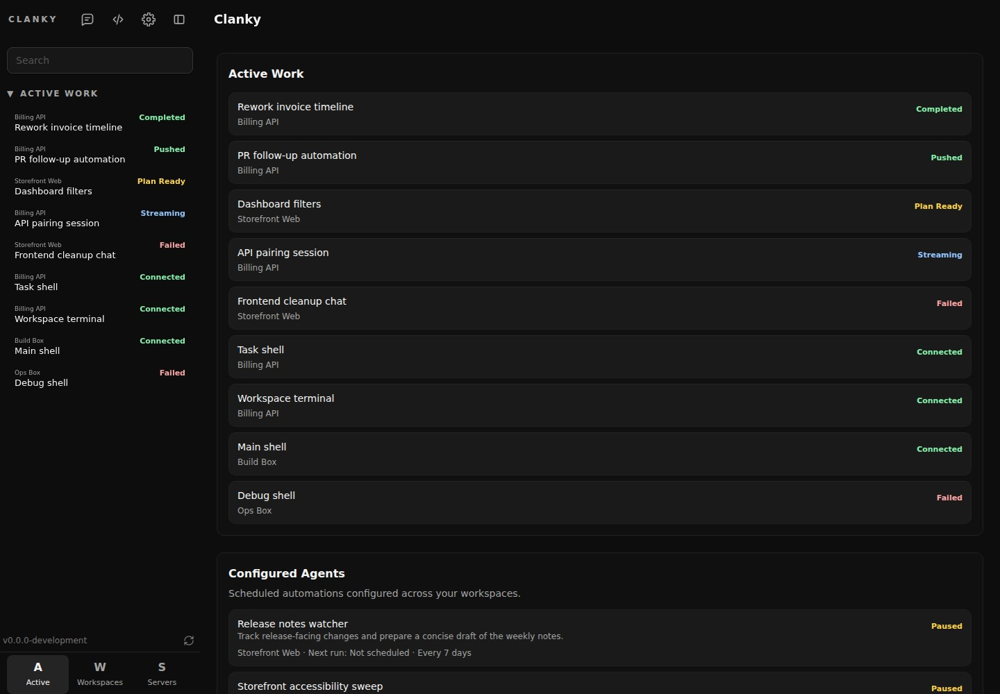
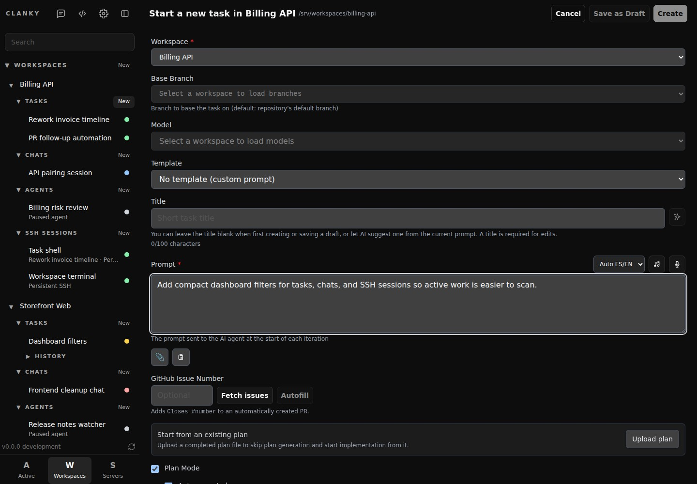
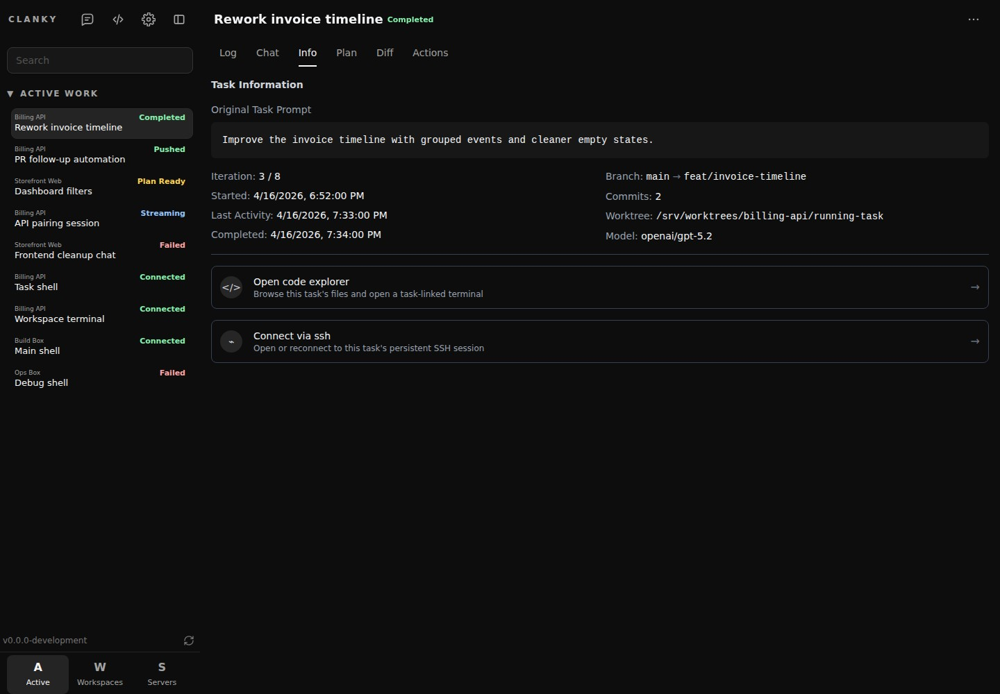
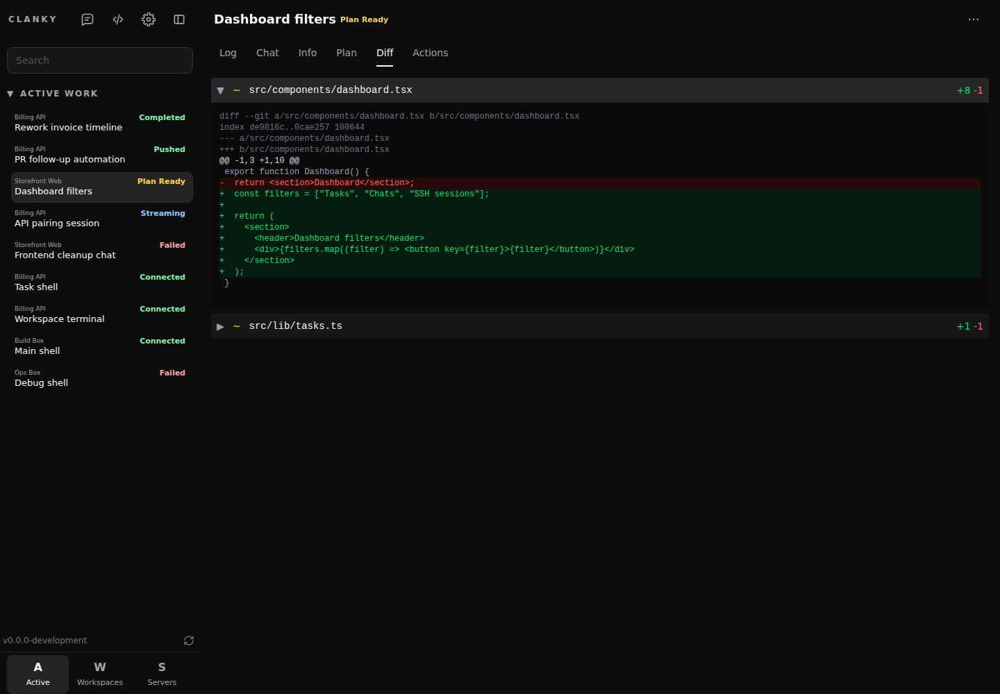
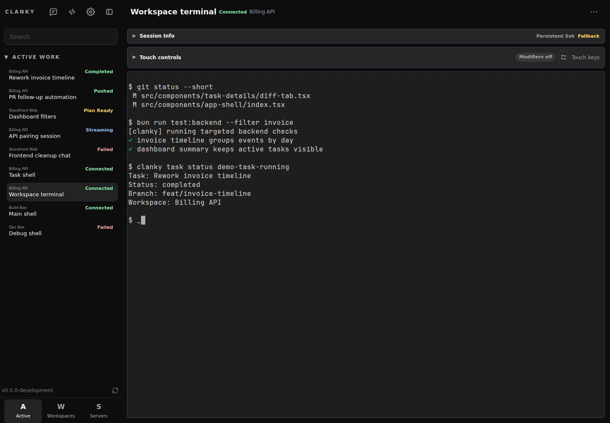

# Clanky

[](https://github.com/pablozaiden/clanky/releases/latest)
[](https://github.com/pablozaiden/clanky/actions/workflows/docker-main.yml)
[](LICENSE)
[](https://bun.sh)

Clanky is a coding agent manager for running, reviewing, and iterating on tasks with coding agents such as Codex, Copilot, OpenCode, Claude Code, Pi, and Grok Build.

The repository is organized as a single Bun app:

- `src` - the Clanky app and binary entrypoint, including the Bun server, React UI, CLI subcommands, shared helpers, API contracts, and client transport utilities.

Shared foundations such as passkey/API-key/device auth, users, settings, app shell, sidebar/title-bar action menus, dialogs, realtime plumbing, health, and server lifecycle operations come from `@pablozaiden/webapp`. Clanky-owned code focuses on coding-agent domains: tasks, chats, agents, workspaces, SSH/VNC sessions, file exploration, and provider/runtime orchestration.

## Best way to use Clanky

While Clanky can be used locally, accessing code repositories and running agents on the same machine, it really shines when it is used with SSH-backed workspaces. This allows you to keep your local machine free of agent processes and dependencies while still managing everything through the Clanky dashboard.

The recommended workflow is to treat Clanky as a controller for SSH-backed development environments, even when that SSH host is just your own machine.

1. Register an `ssh` server in Clanky. Using `localhost` is a great default if you want the SSH workflow without needing a separate remote machine.
2. Create an automatic workspace for each project you want to work on, and let that workspace use your `@pablozaiden/devbox`-managed environment so tools and dependencies are ready inside the project context. Automatic workspaces are docker containers created with [`@pablozaiden/devbox`](https://github.com/pablozaiden/devbox) and automatically exposed over SSH.
3. Once the workspace is ready, either open chats to work interactively with the coding agent in that workspace or create a new task, write the task prompt, and let the agent work autonomously.

**[Download the latest release](https://github.com/pablozaiden/clanky/releases/latest)**



*Dashboard overview with active tasks, workspaces, and quick actions.*

## Why Clanky

- **Safer automation.** Tasks can use an isolated branch/worktree, commit iteration-by-iteration, and be merged or discarded deliberately.
- **Operational visibility.** The dashboard gives you logs, diffs, plan review, task controls, and follow-up flows in one place.
- **Local or remote execution.** Workspaces can use local `stdio` transport or remote `ssh` transports.

<details>
<summary><strong>More screenshots</strong></summary>



*Create a task with prompt, model, and execution settings.*



*Track iteration status and task progress in real time.*



*Review the accumulated changes before accepting or pushing them.*



*Open persistent SSH sessions alongside task execution.*
</details>

## Installation

Install the latest Linux or macOS binary releases:

```bash
curl -fsSL https://raw.githubusercontent.com/pablozaiden/installer/main/install.sh | sh -s -- pablozaiden/clanky
```

The shared installer downloads the latest release asset for Linux or macOS (`x64` or `arm64`) and installs `clanky` in `$HOME/.local/bin`. If that directory is not on your `PATH`, the installer prints the shell profile line to add.

You can also download binaries directly from the [Releases page](https://github.com/pablozaiden/clanky/releases/latest).

Once installed from a release binary, you can update the installed release binaries in place:

```bash
clanky update --check
clanky update
clanky update --version v0.8.1
```

## Quick start

### Requirements

- Git
- An ACP-capable runtime for the provider you select (`copilot`, `opencode`, `grok`, `claude-agent-acp`, `pi-acp`, and/or `codex-acp`). If a runtime is not found, Clanky tries `npx`/`bunx` package fallbacks when available; the Codex provider also requires an installed and authenticated `codex` CLI.
- Optional SSH access to remote workspace hosts if you plan to use `ssh` transport
- [Bun](https://bun.sh) only if you want to run Clanky from source

### Run Clanky

```bash
# Installed server binary (embedded API + web, same-origin)
clanky serve

# Source development (combined API + web, same-origin)
bun dev

# Source development (alias for bun dev; combined API + web)
bun run dev:server
```

The UI is available at `http://localhost:3000` by default. Use `CLANKY_PORT` to change the port and `CLANKY_HOST` to change the bind address.

### CLI client commands

The `clanky` binary exposes both the server and terminal client surfaces:

```bash
# Check which version is installed
clanky version

# Check whether a newer published binary is available
clanky update --check

# Update the installed release binaries in place
clanky update

# Install a specific published release
clanky update --version v0.8.1

# Start device authorization against a specific Clanky server
clanky auth --base-url http://localhost:3000

# Check whether stored CLI credentials are still valid
clanky status

# List the discoverable REST endpoints
clanky api

# Invoke an authenticated API request (prints one JSON object)
clanky api tasks/my-task --method GET

# Inspect the expected schema for an endpoint
clanky schema auth/device

# Stream authenticated websocket events over stdio
clanky ws
```

## Key features

- **Dashboard + API:** manage tasks from the browser or automate them through the REST API.
- **Plan mode:** review and refine a generated plan before code changes begin.
- **Review cycles:** continue completed, pushed, or locally accepted work with follow-up prompts; pushed and locally accepted work can also receive review comments.
- **Live observability:** stream logs, inspect diffs, and track task state.
- **Workspace flexibility:** configure provider and transport per workspace, including remote SSH-backed execution.

## Configuration and deployment

### Common environment variables

| Variable | Description | Default |
| --- | --- | --- |
| `CLANKY_HOST` | Host/interface passed to `Bun.serve` | `127.0.0.1` |
| `CLANKY_PORT` | HTTP port | `3000` |
| `CLANKY_DATA_DIR` | Data directory for SQLite persistence | `./data` |
| `CLANKY_PUBLIC_BASE_URL` | Stable absolute HTTP(S) origin without a path, query, or fragment, advertised to remote execution contexts and mesh peers | unset |
| `CLANKY_REMOTE_ONLY` | Disables local `stdio` transport | unset |
| `CLANKY_PUSHED_TASK_MONITOR_INTERVAL_MS` | Poll interval for monitoring pushed tasks and automatic pull-request flows; values below 60000 are rejected | `120000` |
| `CLANKY_MOCK_ACP` | Uses the built-in fake ACP runtime for local testing | unset |
| `CLANKY_DISABLE_PASSKEY` | Bypasses passkey enforcement when set to `true`, `1`, or `yes` | unset |
| `CLANKY_DISABLE_SAME_ORIGIN_CHECK` | Disables `Origin`/`Referer` validation for state-changing requests and WebSocket upgrades | unset |
| `CLANKY_LOG_LEVEL` | Server log level override | `info` |

SSH retry, keepalive, timeout, and handshake-concurrency values are fixed
application constants in `src/core/ssh-reliability-policy.ts`.

### Auth notes

- Passkey authentication protects the browser session and device-approval flow.
- Device bearer credentials are issued through the framework device authorization
  flow and are stored in the selected CLI profile.
- `clanky ws` is a generic JSON-lines realtime bridge. Its destination comes
  from the selected profile or environment and it does not expose
  Clanky-specific event filters or a positional base URL.
- Bearer tokens are issued through the device authorization flow and work as an alternative to the browser passkey session for APIs, WebSocket upgrades, and preview bridge access.
- `clanky auth` stores framework device credentials in the selected profile under the home directory (or `CLANKY_CLI_HOME` when set), `clanky status` validates them through `GET /api/auth/status`, `clanky api` sends authenticated REST calls with the selected profile, `clanky ws` uses the selected profile for authenticated websocket upgrades to `/api/ws`, and `clanky schema` exposes endpoint discoverability data from the built-in API catalog.
- Non-interactive CLI calls can use the environment API-key pair `CLANKY_BASE_URL` and `CLANKY_API_KEY`. When no stored device credentials are available, framework commands use this pair without persisting or printing the key.
- Clanky exposes `/.well-known/openid-configuration` and `/.well-known/jwks.json` so external clients can verify access tokens.
- Set `CLANKY_DISABLE_PASSKEY=true`, `1`, or `yes` to bypass only the passkey requirement as an emergency override.
- Set `CLANKY_DISABLE_SAME_ORIGIN_CHECK=true`, `1`, or `yes` only for development setups where the frontend intentionally runs on a different local origin than the backend. Leave it unset in normal and production deployments.

### Docker

```yaml
services:
  clanky:
    image: ghcr.io/pablozaiden/clanky:latest
    # Use expose when the reverse proxy is another container on the same network.
    expose:
      - "8080"
    # If the proxy runs on the host, replace expose with:
    # ports:
    #   - "127.0.0.1:8080:8080"
    volumes:
      - clanky-data:/app/data
    environment:
      CLANKY_DATA_DIR: /app/data
      CLANKY_PUBLIC_BASE_URL: https://clanky.example.com

volumes:
  clanky-data:
```

The container listens on port `8080` by default and starts the same embedded server product that the `clanky` binary runs locally. Docker overrides the bind host to `0.0.0.0`; local/native runs default to `127.0.0.1` unless you override `CLANKY_HOST`.

The production image assumes it is reachable only through a reverse proxy and
enables these defaults:

```text
CLANKY_TRUST_PROXY=true
CLANKY_TRUST_PROXY_HEADERS=proto,host,prefix
CLANKY_TRUST_PROXY_CHAIN=first
```

For a public deployment, configure the reverse proxy to:

- terminate TLS and serve Clanky at a stable HTTPS URL;
- remove client-supplied `X-Forwarded-Proto`, `X-Forwarded-Host`, and
  `X-Forwarded-Prefix` headers, then write sanitized values;
- forward WebSocket upgrades for `/api/ws` and the raw terminal, preview, and
  VNC transports;
- keep the application port private, either with `expose` on a shared Docker
  network or a loopback-only host binding;
- set `CLANKY_PUBLIC_BASE_URL` to the external absolute HTTPS origin, without
  a path, query, or fragment, as shown above;
- mount a durable volume for all of `/app/data` and back it up.

For mesh connections between trusted private-network instances, set
`CLANKY_PUBLIC_BASE_URL` on each instance to the absolute HTTP(S) origin
reachable by its peer, such as `http://192.168.1.20:3000`. Do not expose an
HTTP mesh endpoint to an untrusted network.

Mesh can also relay `stdio` workspaces: the active instance remains the
authority, while ACP processes and file/command operations run on the
workspace's persisted execution owner. Keep mesh peers on a trusted network
and use HTTPS (including WebSocket upgrades) when prompts, environment values,
or file contents could cross an untrusted network. SSH-backed workspaces keep
their existing routing and are not moved by mesh execution.

Keep `CLANKY_DISABLE_PASSKEY` and `CLANKY_DISABLE_SAME_ORIGIN_CHECK` unset in
public deployments. The image's trust-proxy defaults are intentionally unsafe
for direct, unproxied exposure because forwarded headers are then
client-controlled.

## Documentation

- [API reference](docs/API.md)
- [Project conventions and agent workflow](AGENTS.md)

## Development

```bash
git clone https://github.com/pablozaiden/clanky.git
cd clanky
bun install
bun run build
bun run test
bun dev
```

`bun run build` creates standalone executables in `dist/`.

### Test execution

Local `bun run test` and `bun run test:backend` use Bun's native file workers.
Set `CLANKY_TEST_MAX_WORKERS` to control the worker capacity; each file runs
isolated with the shared backend-user preload and a conservative
`--max-concurrency 1`. The pull-request workflow still uses the same full-suite
command, while `CI=true` (or `CLANKY_TEST_RETRY_FAILED_BUCKETS=1`) selects the
custom coordinator so failed buckets can be retried in a fresh serial process.
Set `CLANKY_TEST_RUNNER=custom` to select that coordinator explicitly.

Use `bun run test:changed` for local changed-test feedback. Native Bun shard and
generated timing options can be passed to the runner when a caller supplies a
shard count, for example:

```bash
bun scripts/run-tests.ts all --shard=1/4 --timings=.cache/test-timings.json
bun scripts/run-tests.ts all --shard=1/4 --timings=.cache/test-timings.json --update-timings
```

Timing files are generated by Bun and may omit new files; Bun falls back to its
deterministic discovery order for missing entries. Shards are not used as a
replacement for the full-suite CI gate, and no per-file timing table is
maintained in the repository.

#### Runner benchmark reference

The issue #1017 comparison used Bun 1.4.0 on Linux x86_64 with 20 logical CPUs
and the 84-file, 726-test suite. It included cold-cache serial probes and
warm-cache parallel probes, repeated native isolation/non-isolation runs,
count- and timing-balanced four-way shards, and resource cleanup checks. A
representative warm parallel run with ten workers measured:

| Coordinator | Wall clock | Coverage |
| --- | ---: | --- |
| Custom bucket coordinator | 19.2s | 84 files / 726 tests |
| Bun native `--parallel=10` | 15.0s | 84 files / 726 tests |

Across repeated runs, native full-suite times ranged from 16.1s to 21.4s and
custom ten-worker runs from 18.8s to 22.3s. Timing-aware four-way shards
covered every file exactly once with intentionally uneven assignments
(13/8/8/55 files), while count-balanced shards assigned 21 files each. The
native resource checks used `--no-orphans` and found no additional matching
resource processes or temporary directories after teardown; application-owned
cleanup is still required for databases, worktrees, servers, sockets, and ACP
processes. The custom coordinator remains the CI/default retry path because its
fresh-process bucket retry contract is not equivalent to Bun's in-place
per-test retry.

To repopulate local demo data for the UI, run:

```bash
bun tests/test-data-generation/generate-demo-ui-data.ts
```

The versioned SQL seed targets the current database schema directly, including
normalized transcript entries; the generator does not rewrite legacy columns.

## Contributing

1. Fork the repository.
2. Create a feature branch.
3. Make your changes with tests when appropriate.
4. Run `bun run build && bun run test`.
5. Open a pull request.

## License

[MIT](LICENSE)
