# Clanky

[](https://github.com/pablozaiden/clanky/releases/latest)
[](https://github.com/pablozaiden/clanky/actions/workflows/docker-main.yml)
[](LICENSE)
[](https://bun.sh)

Clanky is a coding-agent manager for running, reviewing, and iterating on
software tasks with Codex, Copilot, OpenCode, Claude Code, Pi, and Grok Build.
It combines a web dashboard, an authenticated CLI, isolated workspaces, live
task visibility, chats, and review workflows in one application.

## Product walkthrough

A 42-second tour of chats, remote workers, workspaces, Code Explorer, and live
previews.

https://github.com/user-attachments/assets/25427c86-2b8b-41c0-a77f-4aad427dee93

## Why Clanky

- **Safer automation:** work in isolated branches or worktrees and review
  changes before accepting or pushing them.
- **One control plane:** manage tasks, chats, agents, workspaces, terminals,
  files, previews, and reviews from the dashboard or API.
- **Local or remote execution:** run locally or use a remote SSH or Mesh host
  when the repository and agent should live elsewhere.

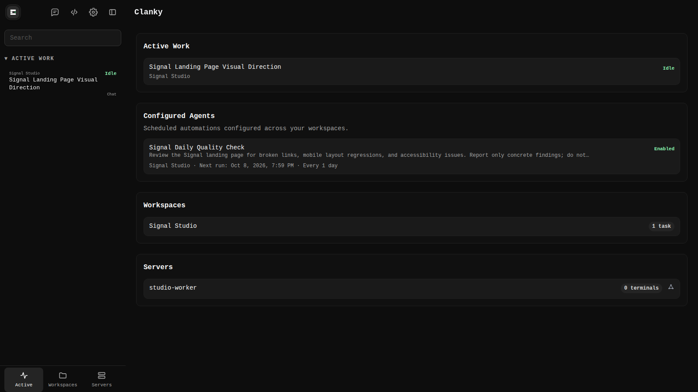

*Active work, scheduled agents, workspaces, and execution hosts in one place.*

<details>
<summary><strong>More screenshots</strong></summary>

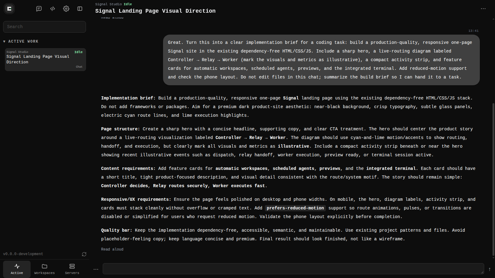

*Start with a conversation, then turn the work into a task.*

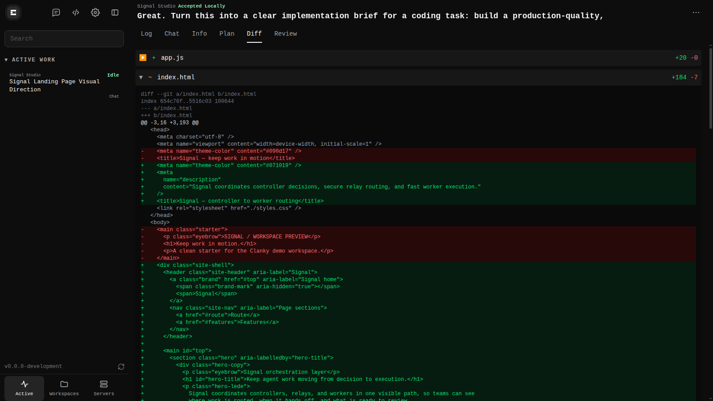

*Inspect the agent's changes before accepting or pushing them.*

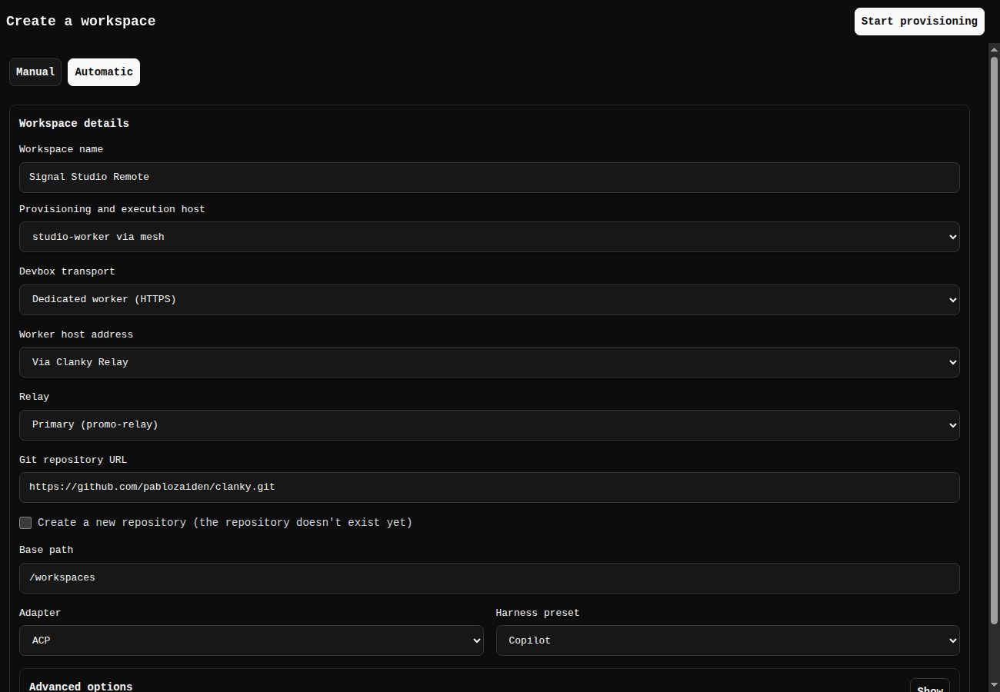

*Provision a dedicated workspace on a remote Mesh worker.*

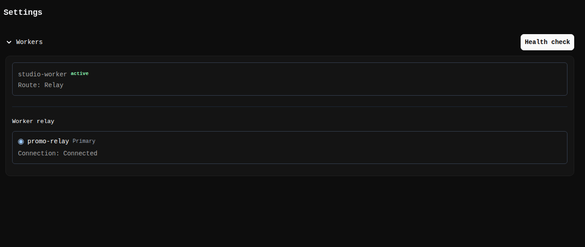

*Check worker health and relay connectivity from the controller.*

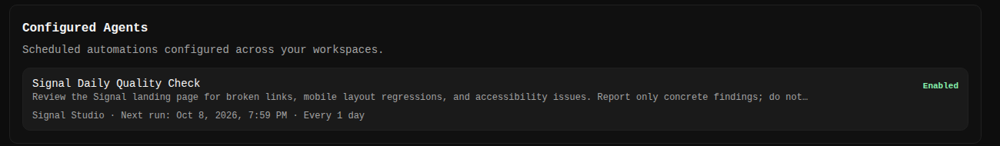

*Keep recurring agent work enabled and visible.*

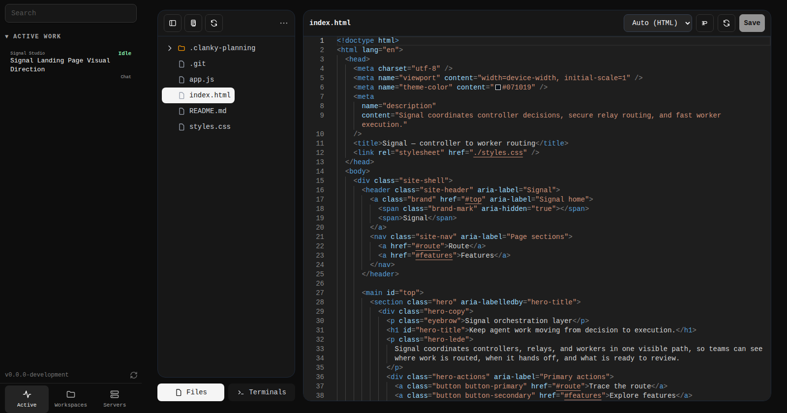

*Browse and edit workspace files in the integrated Code Explorer.*

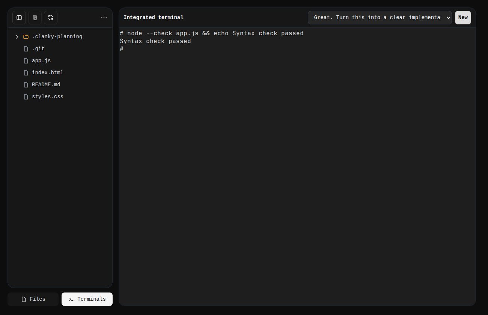

*Run and inspect workspace commands alongside the code.*

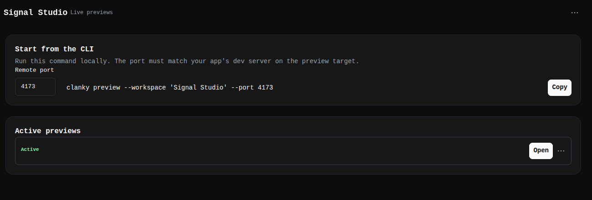

*Open a live preview for the selected workspace.*
</details>

<details>
<summary><strong>Mobile screenshots</strong></summary>

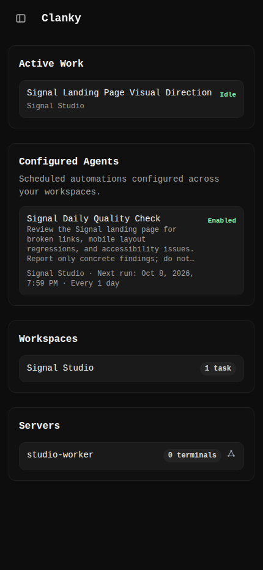

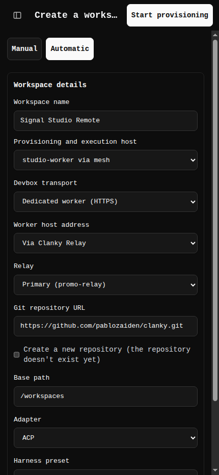

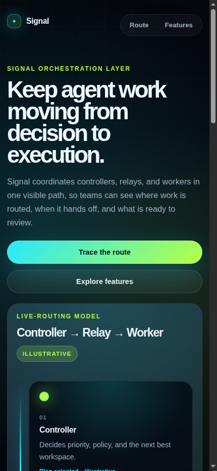
</details>

## Install

Install the latest Linux or macOS binary:

```bash
curl -fsSL https://raw.githubusercontent.com/pablozaiden/installer/main/install.sh \
  | sh -s -- pablozaiden/clanky
```

Or download a binary from the [latest release](https://github.com/pablozaiden/clanky/releases/latest).
The installer verifies the release checksum and places `clanky` in
`$HOME/.local/bin`.

## Quick start

### Requirements

- Git
- An installed native Copilot, Codex or OpenCode 2 runtime, or an ACP-capable
  integration, with its required authentication; see [harness adapters](docs/harnesses.md)
- [Bun](https://bun.sh) only when running Clanky from source

### Start the server

```bash
# Installed binary
clanky serve

# From a source checkout
bun install
bun dev
```

Open <http://localhost:3000>. Use `CLANKY_PORT` or `CLANKY_HOST` to change the
default port or bind address.

### Use the CLI

```bash
clanky auth --base-url http://localhost:3000
clanky status
clanky api
clanky api tasks --method GET
clanky schema tasks
clanky ws
```

See the [getting started guide](docs/getting-started.md) for the first
workspace and task, and the [API reference](docs/API.md) for the complete CLI
and HTTP contract.

### Run with Docker

```bash
docker run -d --name clanky --restart unless-stopped \
  -p 127.0.0.1:8080:8080 \
  -v clanky-data:/app/data \
  ghcr.io/pablozaiden/clanky:latest
```

For a public deployment, keep port `8080` behind a reverse proxy and follow
the [deployment guide](docs/deployment.md).

## Remote execution

Clanky works well as a controller for repositories running on a remote host.
Use the [Mesh worker guide](docs/mesh-worker.md) for automatic workspaces,
worker enrollment, relay connections, and remote execution. The
[deployment guide](docs/deployment.md) covers HTTPS, reverse proxies, and
Docker persistence.

## Documentation

The [documentation index](docs/README.md) organizes the guides by task:

- [Getting started](docs/getting-started.md)
- [Deployment and configuration](docs/deployment.md)
- [Mesh workers and relays](docs/mesh-worker.md)
- [API reference](docs/API.md)
- [Development](docs/development.md)

## License

[MIT](LICENSE)
