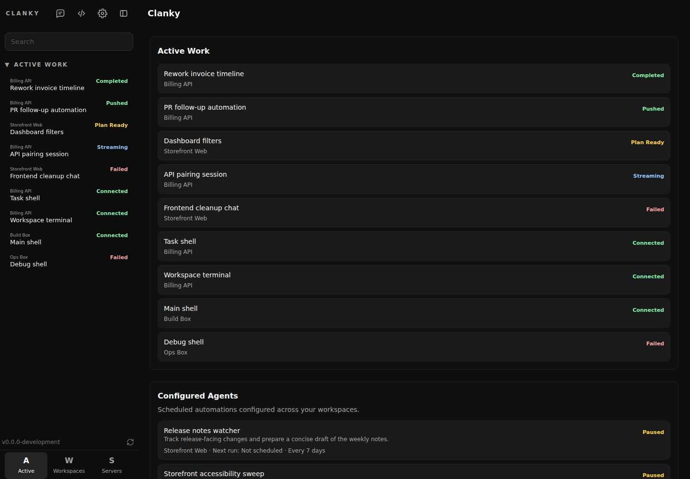
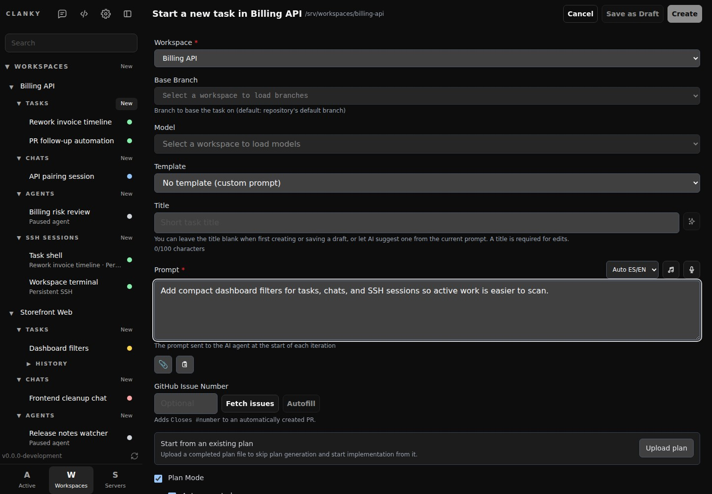
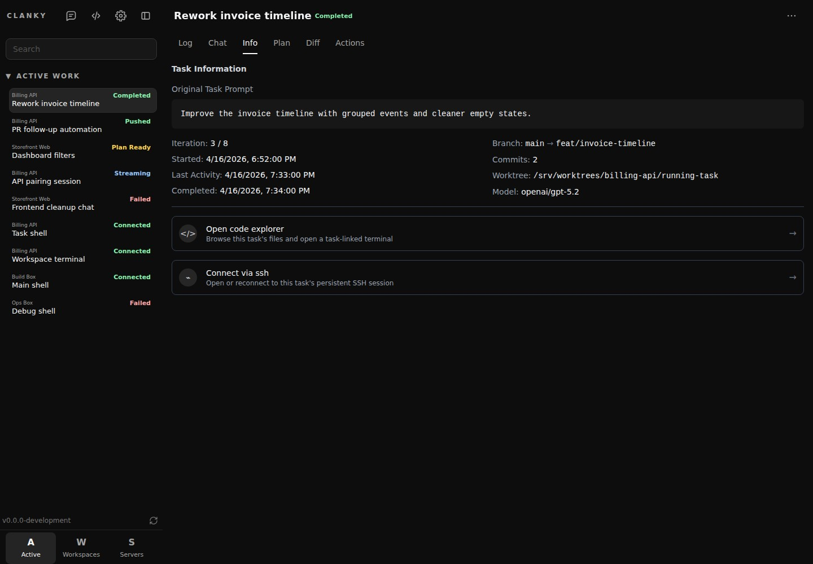
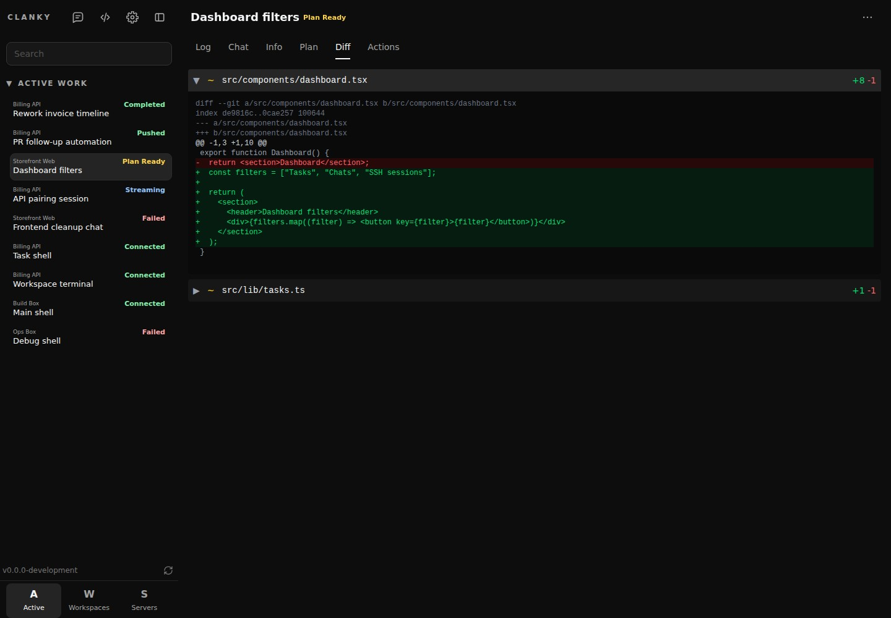
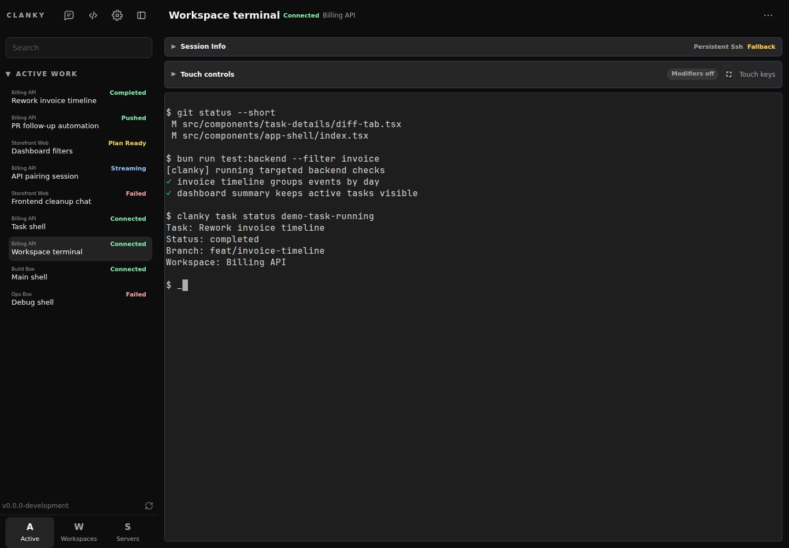

# Clanky

[](https://github.com/pablozaiden/clanky/releases/latest)
[](https://github.com/pablozaiden/clanky/actions/workflows/docker-main.yml)
[](LICENSE)
[](https://bun.sh)

Clanky is a coding-agent manager for running, reviewing, and iterating on
software tasks with Codex, Copilot, OpenCode, Claude Code, Pi, and Grok Build.
It combines a web dashboard, an authenticated CLI, isolated workspaces, live
task visibility, chats, and review workflows in one application.

## Why Clanky

- **Safer automation:** work in isolated branches or worktrees and review
  changes before accepting or pushing them.
- **One control plane:** manage tasks, chats, agents, workspaces, terminals,
  files, previews, and reviews from the dashboard or API.
- **Local or remote execution:** run locally or use a remote SSH or Mesh host
  when the repository and agent should live elsewhere.



*Dashboard overview with active tasks, workspaces, and quick actions.*

<details>
<summary><strong>More screenshots</strong></summary>



*Create a task with prompt, model, and execution settings.*



*Track iteration status and task progress in real time.*



*Review the accumulated changes before accepting or pushing them.*



*Open persistent terminals alongside task execution.*
</details>

## Install

Install the latest Linux or macOS binary:

```bash
curl -fsSL https://raw.githubusercontent.com/pablozaiden/installer/main/install.sh \
  | sh -s -- pablozaiden/clanky
```

Or download a binary from the [latest release](https://github.com/pablozaiden/clanky/releases/latest).
The installer verifies the release checksum and places `clanky` in
`$HOME/.local/bin`.

## Quick start

### Requirements

- Git
- An ACP-capable provider runtime such as `copilot`, `opencode`, `grok`,
  `claude-agent-acp`, `pi-acp`, or `codex-acp`
- [Bun](https://bun.sh) only when running Clanky from source

### Start the server

```bash
# Installed binary
clanky serve

# From a source checkout
bun install
bun dev
```

Open <http://localhost:3000>. Use `CLANKY_PORT` or `CLANKY_HOST` to change the
default port or bind address.

### Use the CLI

```bash
clanky auth --base-url http://localhost:3000
clanky status
clanky api
clanky api tasks --method GET
clanky schema tasks
clanky ws
```

See the [getting started guide](docs/getting-started.md) for the first
workspace and task, and the [API reference](docs/API.md) for the complete CLI
and HTTP contract.

### Expose a workspace as WebDAV

```bash
clanky workspace webdav my-workspace
clanky workspace webdav my-workspace --read-only
```

The foreground command prints a loopback URL and temporary local credentials.
It is **read/write by default**; `--read-only` blocks mutations through this
listener. Keep the command running while the volume is mounted.

On macOS, use Finder's **Go > Connect to Server** (`Cmd+K`), enter the printed
URL, and authenticate with the printed local username/password. For a directory
mount, the native terminal command is:

```bash
mkdir -p "$HOME/Clanky"
mount_webdav -i '<printed URL>' "$HOME/Clanky"
# Unmount before stopping the bridge:
umount "$HOME/Clanky"
```

Clanky does not install FUSE, mount/unmount automatically, or expose a DAV port
on the controller. `Ctrl+C` closes the local listener. Update the **CLI and
controller** together; existing compatible Mesh workers/relays need no new RPCs.

The workspace directory is an initial location, **not a sandbox**. Mount
another absolute path below the same local endpoint to browse elsewhere on the
selected host; an OS volume may prevent navigating above its own mount root.
Host-account permissions still apply. This unrestricted access can include
sensitive files stored on that host.

This is WebDAV, not a complete POSIX filesystem or offline synchronization.
The current controller accepts uploads up to **128 MiB per request**; reverse
proxies may impose lower limits. Larger downloads and host-side copies do not
use this upload limit.
Windows needs an available WebClient service and trusted local HTTPS
(`--tls-cert FILE --tls-key FILE`); do not weaken Basic-auth settings to use
HTTP. Linux mounting depends on an already-installed desktop DAV client or
filesystem driver. Native Finder/mount_webdav, Windows and Linux desktop
mounting have not been validated in the Linux development environment.
See [WebDAV and exact-path file operations](docs/API.md#workspace-webdav-and-exact-path-file-operations)
for authentication, path syntax and protocol limits.

### Run with Docker

```bash
docker run -d --name clanky --restart unless-stopped \
  -p 127.0.0.1:8080:8080 \
  -v clanky-data:/app/data \
  ghcr.io/pablozaiden/clanky:latest
```

For a public deployment, keep port `8080` behind a reverse proxy and follow
the [deployment guide](docs/deployment.md).

## Remote execution

Clanky works well as a controller for repositories running on a remote host.
Use the [Mesh worker guide](docs/mesh-worker.md) for automatic workspaces,
worker enrollment, relay connections, and remote execution. The
[deployment guide](docs/deployment.md) covers HTTPS, reverse proxies, and
Docker persistence.

## Documentation

The [documentation index](docs/README.md) organizes the guides by task:

- [Getting started](docs/getting-started.md)
- [Deployment and configuration](docs/deployment.md)
- [Mesh workers and relays](docs/mesh-worker.md)
- [API reference](docs/API.md)
- [Development](docs/development.md)

## License

[MIT](LICENSE)
